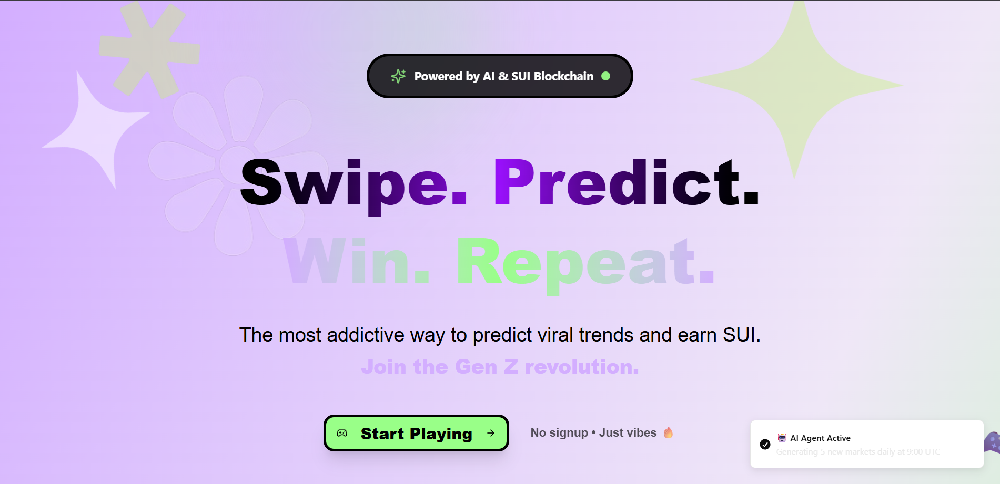
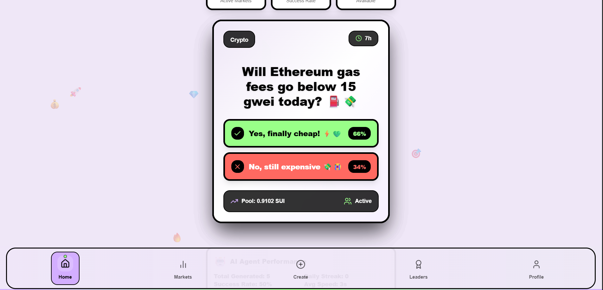
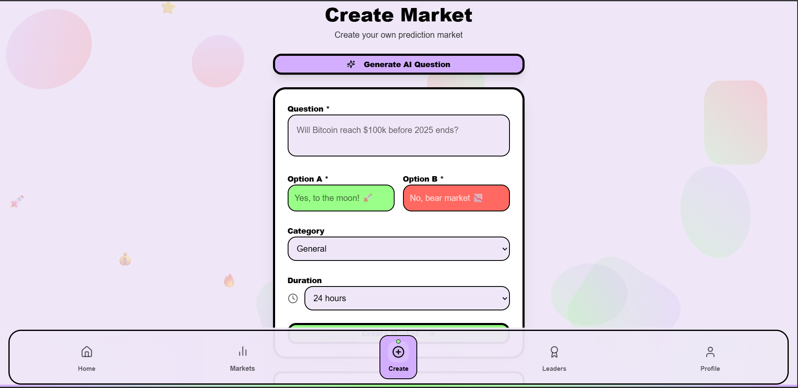
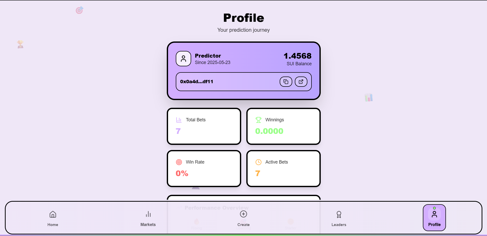

# 🌟 ORBIT - AI-Powered Prediction Markets on SUI

**Swipe. Predict. Win. Repeat.**

*The most addictive way to predict viral trends and earn SUI.*

[](https://orbit-sui.vercel.app/)
[](https://t.me/OrbitPredicta_bot)
[](https://testnet.suivision.xyz/)

## 🎯 What is ORBIT?

ORBIT revolutionizes prediction markets by combining **TikTok-style swipe mechanics** with **AI-generated viral content** on the **SUI blockchain**. Think "Tinder for predictions" - users swipe left to skip, swipe right to bet on trending topics.

### 🔥 Key Features

- **🤖 AI-Powered Markets**: LLaMA 3 generates viral prediction questions daily
- **📱 Tinder-Style UX**: Addictive swipe interface for maximum engagement  
- **⚡ Lightning Fast**: Built on SUI blockchain with minimal fees
- **🎮 Gamified Experience**: Leaderboards, achievements, and social sharing
- **🌐 Multi-Platform**: Web app + Telegram Mini App
- **💎 Real Money**: Bet and win in SUI cryptocurrency

## 🎥 Demo Video

[](https://youtu.be/okzb89taO-k)

[]((https://youtu.be/BYsxLJ_IFcQ))

*Click to watch the full demo*

## 🚀 Live Links

| Platform | Link | Description |
|----------|------|-------------|
| 🌐 **Web App** | [orbit-sui.vercel.app](https://orbit-sui.vercel.app/) | Full featured dApp |
| 📱 **Telegram Bot** | [t.me/OrbitPredicta_bot](https://t.me/OrbitPredicta_bot) | Mini app version |
| 📊 **SUI Explorer** | [View Contract](https://testnet.suivision.xyz/package/0x094249483447f27f10b2127fbca067565aef583050c9e5bafe275911389aa3b7) | Smart contract on testnet |

## 🛠️ Technology Stack

| Frontend | Blockchain | AI/Backend | Tools |
|----------|------------|------------|-------|
|  |  |  |  |
|  |  |  |  |
|  |  |  |  |

## 📱 Screenshots

| Landing Page | Swipe Interface | Market Creation | Profile |
|--------------|-----------------|-----------------|---------|
|  |  |  |  |

## 🔧 Quick Start

### Prerequisites

- Node.js 18+ and pnpm
- SUI Wallet (Suiet, Slush, or official SUI Wallet)
- Groq API key for AI features

### 1. Clone Repository

```bash
git clone https://github.com/Kaustubh-404/SUI-Predicta.git
cd SUI-Predicta
```

### 2. Install Dependencies

```bash
pnpm install
```

### 3. Environment Setup

Create `.env` file:

```env
# Core Configuration
VITE_SUI_NETWORK=testnet
VITE_APP_NAME="ORBIT"
VITE_APP_DESCRIPTION="Viral prediction markets on SUI blockchain"

# Smart Contract Addresses
VITE_PACKAGE_ID="0x094249483447f27f10b2127fbca067565aef583050c9e5bafe275911389aa3b7"
VITE_MARKET_CAP_ID="0x9f27f3d469da201d33704ff1f63ee065c4e936996cc84f77e52fd7b27476d7fe"

# AI Configuration
VITE_GROQ_API_KEY="your_groq_api_key_here"

# Optional: AI Agent Wallet (for automated market creation)
VITE_AI_AGENT_PRIVATE_KEY="your_agent_private_key"

# Default Settings
VITE_DEFAULT_BET_AMOUNT=0.01
```

### 4. Run Development Server

```bash
pnpm dev
```

Visit `http://localhost:5173` to see the app! 🎉

## 🏗️ Project Structure

```
src/
├── components/           # UI Components
│   ├── TinderSwipe.tsx  # Core swipe interface
│   ├── Navigation.tsx   # Bottom navigation
│   ├── WalletConnect.tsx # Wallet integration
│   └── ui/              # Reusable UI components
├── pages/               # Application pages
│   ├── HomePage.tsx     # Main swipe interface
│   ├── MarketsPage.tsx  # Browse all markets
│   ├── CreateMarketPage.tsx # Create new markets
│   ├── ProfilePage.tsx  # User profile & stats
│   └── LeaderboardPage.tsx # Community rankings
├── services/           # Core services
│   ├── productionAIAgent.ts # AI market generation
│   └── blockchainAIAgent.ts # On-chain AI agent
├── lib/                # Utilities
│   ├── aiMarketGenerator.ts # AI content generation
│   ├── suiClient.ts    # Blockchain interactions
│   └── utils.ts        # Helper functions
├── types/              # TypeScript definitions
└── providers/          # React context providers
```

## 🎮 How to Play

### 1. **Connect Wallet**
- Install a SUI wallet (Suiet recommended)
- Get testnet SUI from the [faucet](https://docs.sui.io/testnet/build/faucet)

### 2. **Start Swiping**
- 👈 **Swipe Left**: Skip market
- 👉 **Swipe Right**: Place bet (customize amount)

### 3. **Prediction Categories**
- 🪙 **Crypto**: Bitcoin prices, DeFi trends
- 🏈 **Sports**: Game outcomes, championships  
- 🎬 **Entertainment**: Celebrity news, viral content
- 💻 **Technology**: AI developments, tech stocks
- 🗳️ **Politics**: Elections, policy predictions
- 🎭 **Memes**: TikTok trends, social media

### 4. **Win & Earn**
- Correct predictions win proportional payouts
- Climb leaderboards and earn achievements
- Share results and invite friends

## 🤖 AI Features

### Automated Market Generation

ORBIT's AI agent continuously creates viral prediction markets:

```typescript
// Example AI-generated market
{
  question: "Will Bitcoin break $100k before New Year? 💎🚀",
  optionA: "Yes, diamond hands unite! 💎🙌", 
  optionB: "No, bear market continues 📉💔",
  category: "Crypto",
  confidence: 0.75
}
```

### Intelligence Features

- **📊 Trend Analysis**: Monitors Twitter, Reddit, news
- **🎯 Viral Scoring**: Rates content for shareability
- **⏰ Smart Timing**: Optimizes market duration
- **🏷️ Auto-Categorization**: Balances content types
- **🔄 Real-time Updates**: Responds to breaking news

## 📊 Smart Contracts

### Core Contract Functions

| Function | Description | Gas Cost |
|----------|-------------|----------|
| `create_market` | Deploy new prediction market | ~0.01 SUI |
| `place_bet` | Bet on market outcome | ~0.005 SUI |
| `resolve_market` | Settle market results | ~0.008 SUI |
| `claim_winnings` | Withdraw winnings | ~0.005 SUI |

### Contract Addresses

- **Package ID**: `0x094249483447f27f10b2127fbca067565aef583050c9e5bafe275911389aa3b7`
- **Market Cap ID**: `0x9f27f3d469da201d33704ff1f63ee065c4e936996cc84f77e52fd7b27476d7fe`
- **Network**: SUI Testnet

## 🚀 Deployment

### Vercel Deployment

1. **Connect Repository**
   ```bash
   vercel --prod
   ```

2. **Environment Variables**
   ```bash
   vercel env add VITE_GROQ_API_KEY
   vercel env add VITE_PACKAGE_ID
   vercel env add VITE_MARKET_CAP_ID
   ```

3. **Deploy**
   ```bash
   vercel deploy --prod
   ```

### Telegram Mini App Setup

1. **Create Bot** with [@BotFather](https://t.me/botfather)
2. **Configure Web App** URL: `https://orbit-sui.vercel.app`
3. **Set Menu Button** to launch the app

## 🎯 Roadmap

### Phase 1: Core Platform ✅
- [x] Tinder-style swipe interface
- [x] SUI blockchain integration  
- [x] AI market generation
- [x] Telegram Mini App

### Phase 2: Social Features 🚧
- [ ] Social media feed integration
- [ ] Friend challenges and referrals
- [ ] Enhanced sharing mechanics
- [ ] Influencer partnerships

### Phase 3: Advanced AI 🔮
- [ ] Personalized market recommendations
- [ ] Cross-platform trend analysis
- [ ] Predictive accuracy scoring
- [ ] Automated market resolution

### Phase 4: Expansion 🌍
- [ ] Mainnet deployment
- [ ] Multi-chain support
- [ ] Fiat on-ramps
- [ ] Mobile native apps

## 🛡️ Security

### Smart Contract Security

- ✅ **Audited Move contracts** with safety checks
- ✅ **Multi-signature admin functions** for critical operations
- ✅ **Rate limiting** on market creation
- ✅ **Slippage protection** for large bets

### Frontend Security

- ✅ **Wallet security** through official SUI dApp Kit
- ✅ **Input validation** and sanitization
- ✅ **HTTPS only** deployment
- ✅ **No private key storage** in frontend

### Responsible Disclosure

Found a security issue? Email us at: security@orbit-predicta.com

## 🙏 Acknowledgments

- **SUI Foundation** for the amazing blockchain infrastructure
- **Groq** for lightning-fast AI inference
- **Move Language** for secure smart contract development
- **React Community** for the incredible ecosystem
- **Gen Z** for inspiring the swipe-first design philosophy

### Stay Updated

- 🐦 **Twitter**: [@OrbitPredicta](https://twitter.com/flackk_)
- 📱 **Telegram**: [t.me/OrbitPredicta_bot](https://t.me/OrbitPredicta_bot)

---

**Built with ❤️ for the future of prediction markets**

*Made by builders, for builders, on SUI* 🌊
